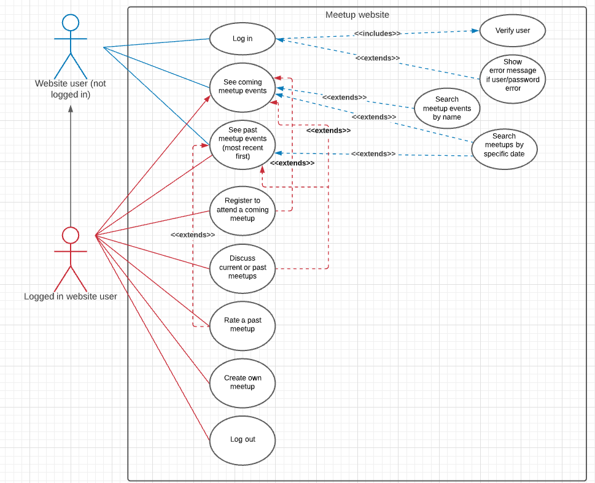

# TDD-Meetup

This project is a final project for the course Design Principles and Patterns at IT-Högskolan.
The details can be found here: [Inlämningsuppgift - Meetup](https://docs.google.com/document/d/136DTDYFeX-N2n4-fI_kryrc2Fv1--wSA-94aIAdNDJE/edit#heading=h.y6j2y3f03r4h)

### Criteria:
- [x] UML use-case diagram
- [x] User stories
- [x] Test Driven Development
- [x] Typescript interfaces describe the data
- [x] Implement the app
- [x] CSS, UI and UX should be functional

### UML Diagram

[Link to UML Use-case diagram](https://lucid.app/lucidchart/e1a7d026-085a-4f03-b951-886bf4a3ca92/edit?invitationId=inv_ab627182-8c22-4a37-bbb9-19315b323cf6)

### User Stories
- As a website user I want to be able to see all upcoming meetups listed by date (soonest first) so that I can see which meetups are happening soon
    - Site renders a list of all coming meetups in chronological order, soonest at the top of the page ✅
    
- As a website user I want to see an overview of all meetups and be able to get more details about the ones that interest me so that I am not overwhelmed by too much information at once
    - Each meetup card contains info about date, time, name and location only. ✅
    - Each meetup card is clickable and leads to a meetup detail page (integration test) ✅

- As a website user I want to be able to search meetups by name so that I can find ones that align with my interests
    - There is a search box on the homepage ✅
    - Search by name filters all meetups and renders those that match ✅
    - Search is case insensitive ✅
    - If search returns nothing a message is rendered on screen ✅
    - the search string is rendered on the page when the search string is not empty ✅

- As a website user I want to be able to see past meetups so that I can see what kind of events happen in my area
    - Site renders a list of past meetups ✅
    - Past meetups are in reverse chronological order ✅
  
- As a website user I want to be able to search past meetups by name so that I can quickly find one I priviously attended
    - Search by name filters all meetups and renders those that match ✅
    - If search returns nothing a message is rendered on screen ✅

- As a website user I want to see the difference between coming and past events so I don't register for an event which is already over
    - Past meetups cards have a different color text ✅
    - Card displays message that event has already happened ✅

- As a website user I want to be able to find past and present meetups by date so I can quickly filter by dates I know I am able to attend
    - There is a date filter on the main page ✅
    - The date filter is rendered on the page ✅
    - Dates can be chosen in the past and future ✅
    - Choosing a date filters the meetups to just the specific date and renders a filtered list on the page ✅
    - If no dates match a 'no matches found' message is rendered ✅

- As a website user I want to be able to undo any filters and searches I do so that I can see all meetups again
    - The search string and date filter string have a cross beside them ✅
    - Clicking the search string button removes the search filter ✅
    - Clicking the date button removes the date filter ✅
    - There is a remove all filters button which clears both search and date ✅

- As a website user I want to be able to see time, date and location of upcoming meetups so that I know when and how to attend
    - Meetup card displays time, date and location ✅
    - Meetup detail page displays time, date and location as well as description and organiser ✅
    - Detail page shows the price of the meetup ✅

- As a website user I want to be able to login so that I can register for events
    - Login button visible in header when user is logged out ✅
    - Clicking the login button takes me to a login page ✅
    - Login button in header is not displayed on login route ✅
    - There is an input for email on the login page ✅
    - There is an input for password on the login page ✅
    - There is a login button on the login page ✅
    - Clicking log in button redirects back to previous page if log in is successful ✅
    - An error is displayed if login credentials are wrong ✅
    - Username is displayed in header when user is logged in ✅
    - Login button is not displayed in header when user is logged in ✅
    

- As a logged in website user I want to be able to register myself for an event so that I can save my place
    - Attend button is visible on meetup detail page when user is logged in, meetup is current and attendee limit hasn't been reached ✅
    - Message "Meetup is fully booked" shows instead of button if meetup is current but limit is reached ✅
    - Message "Meetup is over" shows instead of button if meetup has already happened ✅
    - Clicking the attend button adds user to the attendees list ✅
    - Clicking the attend button reduces places left total by 1 ✅
    - Attend button is no longer visible once registered for event ✅

- As a logged in website user I want to be able to comment on an event so that I can ask questions to the organiser
    - Renders no comment box when user is logged out ✅
    - renders no add button when user is logged out ✅
    - Renders an empty text area with label Add a comment when user is logged in ✅
    - Renders an Add comment button when user is logged in ✅
    - When clicking the button the comment is added to the bottom of the comments list ✅
    - Renders a list of comment cards ✅
    - Comment cards are shown in chronological order (most recent last) ✅
    - Comment cards show date, time, username and comment ✅
    - Renders a no comments yet message when there are no comments 

- As a logged in website user I want to be able to rate a past meetup so that I can give feedback to the organiser and other attendees
    - If meetup has past a rating is shown to everyone or "no rating" message is no ratings have been made ✅
    - If meetup has past and user attended then detail page shows a ratings scale input from 1 - 5 ✅
    - The ratings scale also renders an add rating button ✅
    - The rating average is calculated and shown on screen ✅
    - The rating updates when a new rating is added ✅

- As a logged in website user I want to be able to unregister from a meetup in case I'm no longer able to attend
    - If registered, the meetup detail page will show an unregister button ✅
    - Clicking the button will remove the user from the list of attendees ✅
    - The number of places left will increase by 1 ✅
    - The attend button will show again once the user has unregistered ✅

- As a logged in website user I want to be able to see which meetups I'm registered for so that I can keep track of them (see note below row 145)
    - There is a button to my meetups page in the header ✅
    - My meetups page shows a list of meetups the user is attending
    - My meetups page shows a list of meetups the user has attended
    - My meetups page shows a list of meetups the user is organising

- As a logged in website user I want to be able to log out so that my information is not visible to others sharing the same device
    - When logged in, a log out button is visible in the header ✅
    - When clicked the site logs me out, forgets any data stored and no longer shows my name in the header ✅
    - The log in button should show in the header once logged out. ✅

- As a meetup organiser I want to be able to publish a meetup event so that I can share it with users of the site
    - Once logged in an Add meetup button should render on the main page ✅
    - Clicking the button should take me to an add meetup page with a form to add all the details ✅
    - It shows an add meetup button ✅
    - Submitting the form should validate the input to make sure the meetup date is in the future ✅
    - Once validated, the meetup should be added to the list of meetups and be visible for everyone ✅
    - It should also appear in the correct position in the list according to its date/time when rendered on the screen ✅

- As a meetup organiser I want to be able to limit the amount of users so that I know that there is enough space for everyone
    - The add meetup form should include a limit for number of attendees ✅

- As a meetup organiser I want to be able to comment so that I can answer questions from attendees
    - (see user story for logged in user making comments) ✅

- As a meetup organiser I want to be able to see ratings so that I know how the meetup went
    - (see user story for logged in user adding a rating) ✅

- As a meetup organiser I want to be able to see how many people are coming so that I can plan for the right amount of attendees eg order food/drink
    - Meetup card renders total amount of attendees
    - Meetup detail page renders total amount of attendees ✅

- As a meetup organiser I want to be able to cancel an event in case of unforseen circumstances
    - From My meetups page the organiser is able to delete any events they own
    - Meetups I own should show a delete button
    - Clicking the delete button asks the owner to confirm their choice before removing the meetup from the list

// Persist user data in local storage

// handleAddAttendee function in MeetupDetail does not currently add the meetup id to the user's attending array. This might be needed on the profile page.

// See note in meetupDetail integration tests line 188 - how to reset store/db to initial state in between each test?
// meetup detail integration 522 & 525 - will change if store resets between each test
// 543 - emma is not registered to attend if store gets reset in between, change to joe instead.

// Clean up unused imports

// Current limitations: 
No checks to stop owner clicking attend on their own meetup